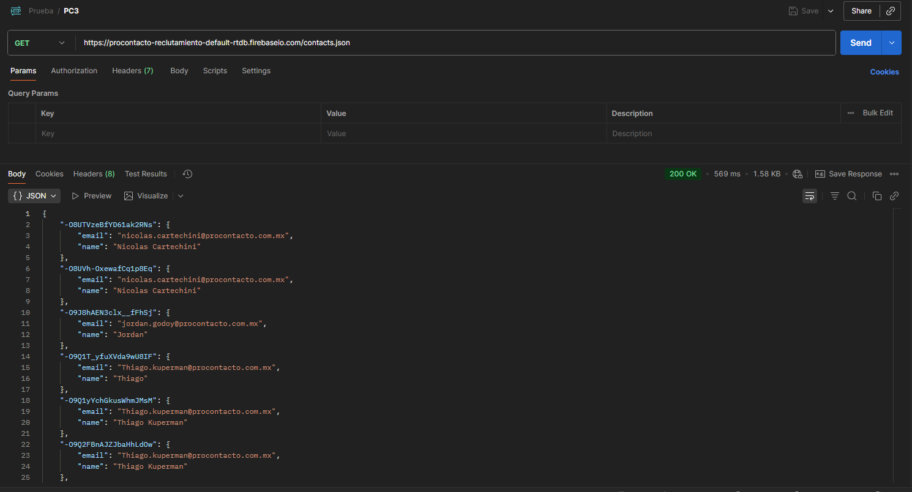

# PC3
INDICE

## Table of Contents
- [Ejercicio 1](#-ejercicio-1)
- [Ejercicio 2](#-ejercicio-2)
- [Ejercicio 3](#-ejercicio-3)
- [Ejercicio 4](#-ejercicio-4)
- [Ejercicio 5](#-ejercicio-5)
- [Ejercicio 6](#-ejercicio-6)

## 🚀 About

---
## EJERCICIO 2

1. ¿Qué es un servidor HTTP?
2. ¿Qué son los verbos HTTP? Mencionar los más conocidos
3. ¿Qué es un request y un response en una comunicación HTTP?
¿Qué son los headers?
4. ¿Qué es un queryString? (En el contexto de una url)
5. ¿Qué es el responseCode? ¿Qué significado tiene los posibles
valores devueltos?
6. ¿Cómo se envía la data en un Get y cómo en un POST?
7. ¿Qué verbo http utiliza el navegador cuando accedemos a una
página?
8. Explicar brevemente qué son las estructuras de datos JSON y XML
dando ejemplo de estructuras posibles.
9. Explicar brevemente el estándar SOAP
10. Explicar brevemente el estándar REST Full
11. ¿Qué son los headers en un request? ¿Para qué se utiliza el key
Content-type en un header?
---

## EJERCICIO 3

1. Realizar un request GET a la URL:

2. Realizar un request POST a la URL anterior, y con body:

3. Realizar nuevamente un request GET a la URL:

¿Qué diferencias se observan entre las llamadas el punto 1 y 3?

---
## EJERCICIO 4
---
## EJERCICIO 5

1. Lead
2. Account
3. Contact
4. Opportunity
5. Product
6. PriceBook
7. Quote
8. Asset
9. Case
10. Article

---

## EJERCICIO 6
Responder las siguientes preguntas brevemente sobre: Soluciones de Salesforce
A. ¿Qué es Salesforce?
B. ¿Qué es Sales Cloud?
C. ¿Qué es Service Cloud?
D. ¿Qué es Health Cloud?
E. ¿Qué es Marketing Cloud?

Funcionalidades de Salesforce
A. ¿Qué es un RecordType?
B. ¿Qué es un ReportType?
C. ¿Qué es un Page Layout?
D. ¿Qué es un Compact Layout?
E. ¿Qué es un Perfil?
F. ¿Qué es un Rol?
G. ¿Qué es un Validation Rule?
H. ¿Qué diferencia hay entre una relación Master Detail y Lookup?
I. ¿Qué es un Sandbox?
J. ¿Qué es un ChangeSet?
K. ¿Para qué sirve el import Wizard de Salesforce?
L. ¿Para qué sirve la funcionalidad Web to Lead?
M. ¿Para qué sirve la funcionalidad Web to Case?
N. ¿Para qué sirve la funcionalidad Omnichannel?
O. ¿Para qué sirve la funcionalidad Chatter?

Conceptos generales
A. ¿Qué significa SaaS?
B. ¿Salesforce es Saas?
C. ¿Qué significa que una solución sea Cloud?
D. ¿Qué significa que una solución sea On-Premise?
E. ¿Qué es un pipeline de ventas?
F. ¿Qué es un funnel de ventas?
G. ¿Qué significa Customer Experience?
H. ¿Qué significa omnicanalidad?
I. ¿Qué significa que un negocio sea B2B?¿Qué significa que un negocio sea
B2C?¿Qué es un KPI?
J. ¿Qué es una API y en qué se diferencia de una Rest API?
K. ¿Qué es un Proceso Batch?
L. ¿Qué es Kanban?
M. ¿Qué es un ERP?
N. ¿Salesforce es un ERP?

