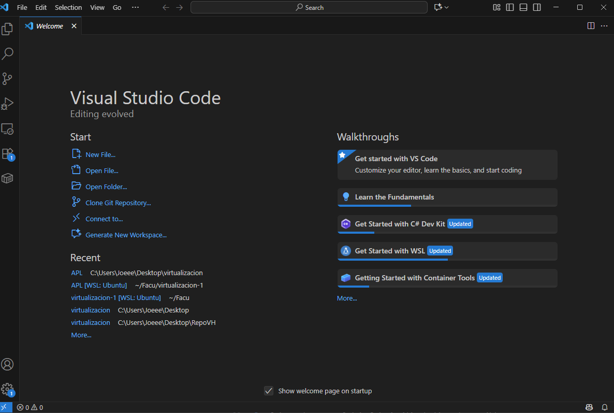
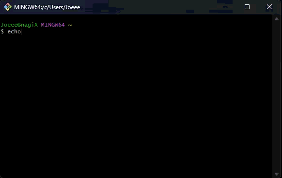

# PC

Joel Murillo
Año 2025

## Tabla de indices
- [Ejercicio 1](#ejercicio-1)
- [Ejercicio 2](#ejercicio-2)
- [Ejercicio 3](#ejercicio-3)
- [Ejercicio 4](#ejercicio-4)
- [Ejercicio 5](#ejercicio-5)
- [Ejercicio 6](#ejercicio-6)

---

## EJERCICIO 1

### VSCODE


### GIT BASH


---

## EJERCICIO 2


### PREGUNTAS
### RESPUESTAS
1. Es un servidor que utiliza el protocolo HTTP para el manejo de solicitudes
2. Son comandos o tipos de solicitudes que un cliente o usuario le puede hacer a un servidor HTTP , estos son GET,PORT,PUT y DELETE.
3. Un request es una solicitud que un cliente le realiza al servidor , un response es la respuesta que devuelve el servidor a la solicitud que mando el cliente.
4. Los headers son informacion adicional que se envia al ocurrir un response o request , por ejemplo una fecha y hora de la solicitud , o el formato de texto utilizado.
5. ¿Qué es un queryString? (En el contexto de una url)
6. Es un codigo que me dice si ocurrio un fallo o la solicitud fue manejada de forma correcta por el servidor , tenemos por ejemplo :
   200 OK
   300 REDIRECCION
   400 ERROR SERVIDOR
   500 ERROR CLIENTE
7. La data para un GET se envia desde la URL , como por ejemplo localhost/Cliente?id=123. Mientras que los datos para realizar un POST se envian a traves de body , por ejemplo un JSON.
8. El verbo que utiliza el navegador cuando accedemos a una pagina es GET
9.
   XML un lenguaje de marcado que usa etiquetas para estructurar y describir datos.
  ```xml
   <usuario>
     <nombre>Joel</nombre>
     <estado>online</estado>
   </usuario>
  ```
   JSON es un formato de texto ligero para representar datos estructurados, fácil de leer y procesar por humanos y máquinas.
  ```json
   {
     "nombre": "Joel",
     "estado": "online"
   }
  ```
12. Explicar brevemente el estándar SOAP
13. Explicar brevemente el estándar REST Full
14. ¿Qué son los headers en un request? ¿Para qué se utiliza el key
Content-type en un header?
---

## EJERCICIO 3

1. Realizar un request GET a la URL:


2. Realizar un request POST a la URL anterior, y con body:


3. Realizar nuevamente un request GET a la URL:


¿Qué diferencias se observan entre las llamadas el punto 1 y 3?
En el paso 3 aparece un nombre que no estaba presente en el paso 1 , esto es debido al POST que realice con mis datos en el paso 2.
---
## EJERCICIO 4
[](https://www.salesforce.com/trailblazer/ytp32goxlbrkzkzx8h)

---
## EJERCICIO 5

1. Lead
2. Account
3. Contact
4. Opportunity
5. Product
6. PriceBook
7. Quote
8. Asset
9. Case
10. Article

---

## EJERCICIO 6
Responder las siguientes preguntas brevemente sobre: Soluciones de Salesforce
A. Salesforce es un CRM que corre en la nube.
B. ¿Qué es Sales Cloud?
C. ¿Qué es Service Cloud?
D. ¿Qué es Health Cloud?
E. ¿Qué es Marketing Cloud?

Funcionalidades de Salesforce
A. ¿Qué es un RecordType?
B. ¿Qué es un ReportType?
C. ¿Qué es un Page Layout?
D. ¿Qué es un Compact Layout?
E. ¿Qué es un Perfil?
F. ¿Qué es un Rol?
G. ¿Qué es un Validation Rule?
H. ¿Qué diferencia hay entre una relación Master Detail y Lookup?
I. ¿Qué es un Sandbox?
J. ¿Qué es un ChangeSet?
K. ¿Para qué sirve el import Wizard de Salesforce?
L. ¿Para qué sirve la funcionalidad Web to Lead?
M. ¿Para qué sirve la funcionalidad Web to Case?
N. ¿Para qué sirve la funcionalidad Omnichannel?
O. ¿Para qué sirve la funcionalidad Chatter?


Conceptos generales
A. Software as a Plataform
B. Si Salesforce es SaaS
C. Que corre en la nube , por ende el cliente no debera gastar en hardware.
D. ¿Qué significa que una solución sea On-Premise?
E. ¿Qué es un pipeline de ventas?
F. ¿Qué es un funnel de ventas?
G. ¿Qué significa Customer Experience?
H. ¿Qué significa omnicanalidad?
I. ¿Qué significa que un negocio sea B2B?¿Qué significa que un negocio sea
B2C?¿Qué es un KPI?
J. ¿Qué es una API y en qué se diferencia de una Rest API?
K. ¿Qué es un Proceso Batch?
L. ¿Qué es Kanban?
M. ¿Qué es un ERP?
N. ¿Salesforce es un ERP?

